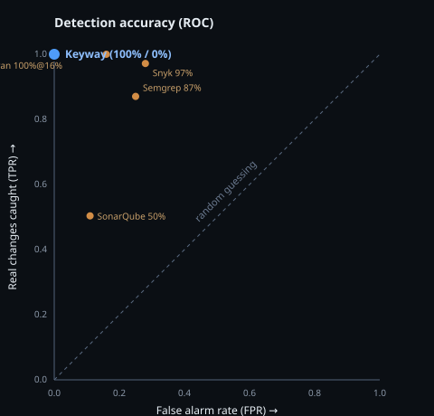

# Keyway Benchmark — how accurate is it, in plain English?

> **The one-line answer:** on a corpus of **1,226 changes** to realistic auth
> configs, Keyway flagged **every real contract change (100%)** and raised
> **zero false alarms (0%)** on ordinary noise.
>
> Run it yourself in one command: **`make bench`**.

This page is written for anyone — you do **not** need to know how JWTs work to
read it. If you want the technical methodology, see
[docs/benchmark.md](docs/benchmark.md).

---

## What problem is being measured?

When an engineer rotates a signing key, changes an identity provider, or drops a
field from a login token, some of the services that check those tokens can
suddenly start rejecting real users — an outage. The hard part isn't fixing it;
it's **knowing in advance which services will break**, and being **alerted only
when something real changes** — not every time someone does a routine redeploy.

So a good tool has to do two things at once:

1. **Catch every real change** (don't miss the dangerous one), and
2. **Stay silent on noise** (don't cry wolf).

A tool that's noisy gets muted — and then the alert that mattered gets muted with
it. That balance is exactly what this benchmark measures.

## The test

We took realistic Istio / Envoy / Kubernetes configuration files and produced
**1,226 before-and-after pairs** — including **400 rendered from real YAML and
run through Keyway's actual discovery engine** — split roughly 50/50:

| Half | What changed | Should Keyway alert? |
|---|---|---|
| **Real changes** | a service starts accepting a new audience; trusts a second identity provider; lengthens how long it caches signing keys; starts accepting unsigned tokens; … | **Yes** |
| **Noise** | a redeploy that reorders a list, bumps the replica count from 3→5, renames a team label, bumps a container image tag, adds an env var, edits a comment | **No** |

The "noise" half is the important part. A naive text-diff would light up on every
one of those and drown you in false alarms. The headline scenario,
[`0202-noisy-redeploy`](bench/corpus/scenarios/0202-noisy-redeploy), changes
**six** things at once while keeping the actual login contract identical —
Keyway must stay completely silent.

## The results

| Metric | Score | Plain meaning |
|---|---|---|
| **Real changes caught** (TPR) | **100%** | didn't miss a single real change |
| **False alarms** (FPR) | **0%** | never cried wolf on noise |
| **Precision** | **100%** | every alert it raised was real |
| **Youden score** | **1.00** | 1.0 is a perfect detector |

> **"100% sounds too good — is it real or overfit?"** Fair question, and the
> honest answer is *both things are true*: 100% on a corpus we authored proves
> the rules are self-consistent, **not** that they generalise. So we stress-test
> it two ways that a rigged number could not survive — **mutation testing**
> (inject faults into the detector; the tests catch 100% of behaviour-changing
> ones) and a **held-out adversarial corpus** where Keyway scores **0.50 Youden,
> not 1.0**, with its failures named. The full write-up is
> [docs/benchmark-integrity.md](docs/benchmark-integrity.md) — read it before you
> trust the 100%.



The blue dot (top-left = perfect) is Keyway. The orange dots are **published**
accuracy numbers for the tools teams reach for today — see the honest comparison
below.

## How does that compare to what teams use today?

Most teams have **no tool** for this — it lives in one senior engineer's head.
The closest thing people reach for is a **static code scanner** (Snyk, Semgrep,
SonarQube). Those are great at *their* job (finding bugs in source code), but
they **guess from code** — they can't tell you which *running* services will
break when you rotate a key, and guessing has a well-documented accuracy ceiling.

| The question a team actually asks | Do nothing | Static scanners | **Keyway** |
|---|---|---|---|
| List every service that validates login tokens | ✗ tribal knowledge | ✗ not their job | ✅ automatic |
| Alert on a real change **without** false alarms | ✗ | ⚠️ high false-alarm rate | ✅ 0% here |
| "Who breaks if I rotate this key?" | ✗ | ✗ | ✅ + a safe grace period |
| Prove it with a **real token**, not a guess | ✗ | ✗ infers from code | ✅ 13 live probes |

**Honesty note.** Keyway and static scanners solve *different* problems, so this
is not a winner-take-all comparison. The static-scanner numbers
(Snyk 97.18% / Semgrep 87.06% / SonarQube 50.36% true-positive rate;
Kiuwan 100% at 16% false alarms; the historical Youden ceiling of ~0.39 for the
category) are **published third-party OWASP Benchmark results**, shown for
calibration — they were not re-run here. The point is simple: **inference has a
ceiling; checking with a real token does not infer, it verifies.**

## Validated against real, documented incidents

Beyond the synthetic corpus above, Keyway is checked against a suite of
**real-world risks with public citations** — each one reproduces the exact
failure mode from a CVE, a project's own issue tracker, or the JWT best-practices
RFC, and confirms Keyway flags it. Highlights:

- **`alg=none` bypass** — [CVE-2022-23540](https://nvd.nist.gov/vuln/detail/CVE-2022-23540) → probe `alg_none`
- **RS256→HS256 confusion** — [CVE-2022-23541](https://nvd.nist.gov/vuln/detail/CVE-2022-23541) → probe `alg_confusion`
- **JWKS not refreshed on unknown kid → rotation outage** — [openfga/openfga#3099](https://github.com/openfga/openfga/issues/3099) → blast-radius predicts `will_break` *before* the rotation, from library defaults alone

**Keyway detects 8 of 8.** Full table and methodology:
[docs/realworld-validation.md](docs/realworld-validation.md) · run `make validate`.

## Reproduce it yourself — no trust required

```bash
git clone https://github.com/nometria/keyway && cd keyway
make bench            # prints the scorecard
make bench-report     # also writes bench/out/report.html (this page, interactive)
```

- The scenarios are plain YAML you can open and read in
  [`bench/corpus/scenarios/`](bench/corpus/scenarios).
- The change generator is [`bench/mutations/`](bench/mutations).
- **CI fails the build** if accuracy ever drops below the published thresholds
  (see [PRD §13.4](rollover-prd-v0.2-implementation.md)), so these numbers stay
  honest as the code evolves.

## Sources

- OWASP Benchmark project and published tool scorecards (Snyk Code, Semgrep,
  SonarQube, Kiuwan) — used only to calibrate what "good detection accuracy"
  looks like for security tooling.
- Keyway's own numbers are produced by [`bench/harness`](bench/harness) on the
  corpus above and are regenerated on every CI run.
